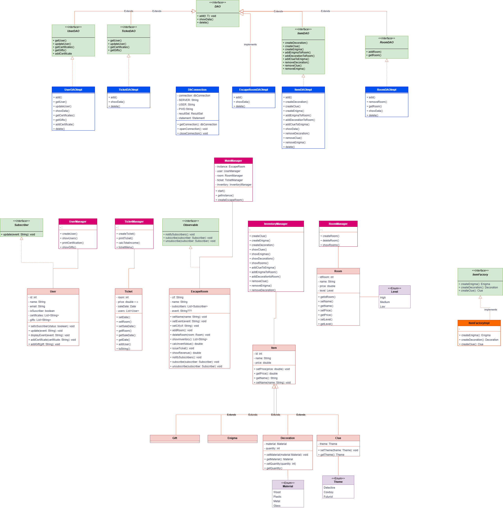

# EscapeRoom

Treball en grup per desenvolupar un projecte de cero amb connexió a base de dades sense cap framework.

## Enunciat

Hem de desenvolupar una aplicació per gestionar un Escape Room virtual, on els usuaris puguin gaudir d'aventures emocionants i resoldre enigmes desafiant. Com a persistència farem servir MySQL.

L'aplicació ha de complir amb els següents requisits:

- En el nostre Escape Room virtual, que té un nom específic, oferim una varietat de sales temàtiques, pistes intrigants i objectes de decoració únics.
- Cada sala té assignat un nivell de dificultat per proporcionar una experiència equilibrada i desafiadora
- Les pistes estan dissenyades amb temes específics per guiar els jugadors en la cerca de solucions
- Els objectes de decoració contribueixen a crear una atmosfera immersiva i memorable a cada sala, utilitzant diferents tipus de materials.
- Tots els elements tenen un preu associat que reflecteix el seu valor en el joc
- El nostre Escape Room virtual ha de mantenir un inventari actualitzat de totes les sales, pistes i objectes de decoració disponibles.
- A més, portarem un registre del valor total de l'inventari per tenir una visió clara dels nostres actius.
- L'aplicació oferirà una funcionalitat per emetre certificats de superació d'enigmes, on es registraran els assoliments aconseguits pels jugadors durant la seva experiència a l'Escape Room.
- A més, se'ls podran atorgar possibles regals o recompenses com a reconeixement per la seva habilitat i destresa en resoldre els reptes plantejats.

Pel que fa a les funcionalitats a mostrar per pantalla, s'espera que inclogui com a mínim les següents:

- Crear un nou Escape Room virtual.
- Afegir una nova sala amb el seu respectiu nivell de dificultat.
- Incorporar pistes temàtiques per enriquir l'experiència de joc.
- Introduir objectes de decoració per ambientar les sales de manera única.
- Mostrar l'inventari actualitzat, mostrant les quantitats disponibles de cada element (sales, pistes i objectes de decoració).
- Visualitzar el valor total en euros de l'inventari de l'Escape Room virtual.
- Permetre la retirada de sales, pistes o objectes de decoració de l'inventari.
- Generar tiquets de venda per als diferents jugadors/es.
- Calcular i mostrar el total d'ingressos generats per vendes de tiquets de l'Escape Room virtual.
- Notificar als usuaris sobre esdeveniments importants a l'Escape Room, com l'addició de noves pistes, la finalització d'una sala, etc.
- Els usuaris interessats en aquests esdeveniments podran sol·licitar registrar-se per poder rebre notificacions quan es produeixin esdeveniments rellevants

## La nostra solució

A la nostra solució, hem decidit crear el seguent Model de MySQL:

Al nostre programa Java, hem implementat un MainManager que comença el menú principal, previa creació de l'Escape Room. Després, segons les opcions del menú, hem creat diferents managers per repartir responsabilitats. Per exemple, l'Inventory Manager empra un factory per crear els diferents items (decoració, enigmes, pistes i regals) i s'encarrega de la lògica referent a crear, mostrar i eliminar inventari. Per altre banda, el Game Manager crea un joc a partir d'una sala i una llista de jugadors, assignant de forma aleatoria els enigmes resolts per cada jugador, els certificats i els regals corresponents. 

A més, hem creat una serie d'utils per gestionar els menús i les entrades per consola, el DBConnection que gestiona la connexió a base de dades i les queries de forma independent, i molt més que podreu trobar al diagrama UML.

Com a patrons, hem aplicat:
- Observer, per notificar als subscriptors de novetats
- Callback, pel parser del gestor de connexió DBConnection que implementen tots els DAOs
- Singleton, per la creació dels diferents Managers i el DBConnection
- Factory, per crear els diferents items

## Testing: Testa almenys dues funcionalitats clau de l'aplicació.

Hem testejat alguns DAO del projecte, amb idea d'implementar tots en un futur.
La idea es fer un mock del DBConnection de manera que poguem revisar:
1. Que la llista d'atributs que es crea al DAO i es passa al DBConnection és correcte.
2. Que la query per DDBB té el nombre d'atributs esperats.

També hem testejar el mètode d'afegir una room al InventoryManager. La idea és fer el test de tots els elements que s'afegeixen als diferents Managers en un futur.
En aquest cas hem fet un mock del RoomDAO, del observable (en l'aplicació real implementat pel MainManager) i de l'entrada de dades per consola. Després hem testejat:
1. Que l'objecte Room que arriba al DAO coincideix amb el que es crea des del RoomHelper cridat per l'InventoryManager.
2. Que quan el DBConnection reporta que la nova room s'ha creat correctament a base de dades, es notifica a l'observer perquè pugui notificar als Subscribers dels canvis.

